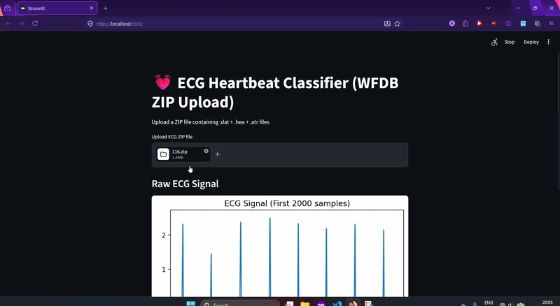

# ❤️ Heartbeat Classifier


A machine learning web app that classifies **heartbeat signals** using the **MIT-BIH Arrhythmia Dataset**. Built with a simple and interactive **Streamlit UI**.

---

# 📊 Dataset

* **Source:** MIT-BIH Arrhythmia Dataset
* Input data provided as `116.zip` (ECG signal samples)

---

# 🤖 Model

* Supervised machine learning model trained on heartbeat data
* Classifies different types of heartbeats based on ECG signals


---

# 🛠️ Tools & Libraries

* Python 🐍
* pandas
* numpy
* scikit-learn
* streamlit
* joblib

---

# 🚀 How to Run

### 1️⃣ Clone the repository

```bash id="cln123"
git clone https://github.com/Aditya13136/Heartbeat-Classifier.git
cd AA
```

### 2️⃣ Create virtual environment

```bash id="venv12"
python -m venv venv
```

Activate it:

```bash id="winact"
venv\Scripts\activate
```

---

### 3️⃣ Install dependencies

```bash id="inst45"
pip install -r requirements.txt
```

---

### 4️⃣ Run Streamlit app

```bash id="run78"
streamlit run app.py
```

---

### 5️⃣ Upload Dataset

* Upload `116.zip` inside the app interface (if required)
* Ensure the dataset is properly extracted/processed if your code expects it

---

# 🎬 Demo





---

# 📝 Notes

* Make sure the dataset format matches what the model expects
* You can improve accuracy by:

  * Using deep learning models (CNN/LSTM)
  * Increasing training data
* Designed for educational and experimental use

---

# 📁 Project Structure

```id="struct11"
Heartbeat-Classifier/
│
├── data/
│   └── 116.zip
│
├── models/
│   └── model.pkl
│
├── app.py
├── requirements.txt
├── README.md
└── .gitignore
```

---

# 📌 Future Improvements

* Add real-time ECG input support
* Deploy using Streamlit Cloud
* Improve model performance with deep learning
